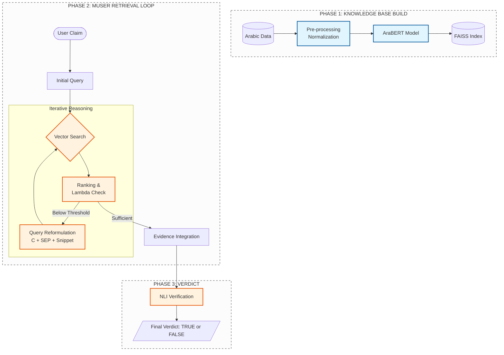

# Arabic MUSER: Fake News Detection System

This project implements a multi-step retrieval system (MUSER) optimized for the Arabic language. It uses **AraBERT** for embeddings and **FAISS** for efficient vector searching.

## System Architecture

## Tech Stack
* **Language:** Python
* **Embeddings:** AraBERT (HuggingFace)
* **Vector Store:** FAISS
* **Framework:** LangChain
